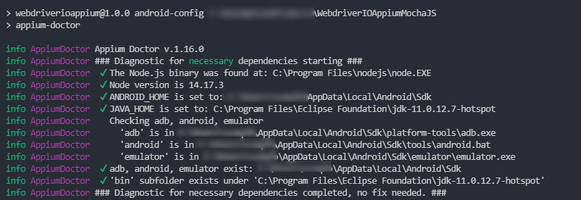

#### Install Appium Server
```
npm install -g appium@next          [ install appium CLI version 2.0.0-beta.24 ]
npm install -g appium-doctor        [ install appium doctor ]
appium --version                    [ To check appium version ]
```

#### Verify drivers
```
appium driver list                  [ To check available drivers ]
appium driver install uiautomator2  [ install android driver]
appium driver install xcuitest      [ install ios driver]
```

#### Setup Android SDK path environment variable
```
- ANDROID_HOME = <path to Sdk folder>
- %ANDROID_HOME%\tools [path variable]
- %ANDROID_HOME%\tools\bin  [path variable]
- %ANDROID_HOME%\platform-tools  [path variable]
```

#### Setup/Create virtual device on Android studio:
1) Open Android Studio.
2) Click on Tools -> AVD Manager -> Create Virtual Device -> Select the device and OS version (from below device details) -> Finish.
3) Once Virtual device is created, click on Launch this AVD in the emulator.
4) Command to view the list of devices attached `adb devices`

```
Device 1:
---------
platformName: Android
android verion: 11
deviceName: Pixel 3

Device 2: [ for parallel execution]
---------
platformName: Android
android verion: 10
deviceName: Nexus 6
```


#### Verify all setup
```
appium-doctor --android        [ To check Android set up ]
appium-doctor --ios            [ To check ios set up ]
```
all options should be green checked as shown in below image to start.


[Go Back to main README](../../README.md)
